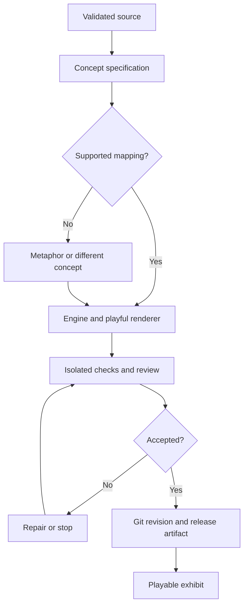

# Mathematical Playground: source-driven, playful interactive exhibits

Status: Proposed design; no upload, AI generation or exhibit runtime is implemented by this document.

Design version: 0.1.0

Date: 2026-10-01

Author: Sol, continuing the GyLiber engineering collaboration at Gyile's request.

Home: GyLiber Command Center, with independently versioned exhibit packages.

## 1. Product responsibility

Transform selected mathematics from Gyile's existing LaTeX into a playful interactive drawing whose behavior is grounded in an inspectable mathematical model. Preserve the generated model, renderer and verification in Git so the exhibit can be revisited, reproduced and improved.

The default experience is a colourful, goofy scene with a small number of meaningful interactions. Equations and formal proofs belong in an optional source/explanation drawer rather than becoming the main screen again. A childlike visual style describes the artwork, not the audience or mathematical depth.

LaTeX remains the mathematical source. Git already provides programming continuity; Obsidian already holds module notes. This feature adds a derived visual experience and does not introduce a duplicate task manager, note editor, readiness dashboard or resume-work journal.

The qualification benefit is a hypothesis: a useful scene may help Gyile reconstruct a concept or proof. Visual enjoyment is a separate, valid benefit. Neither enjoyment nor successful interaction establishes examination competence or income.

## 2. Terminology and feasibility

| Term | Meaning in this design |
| --- | --- |
| Source | Uploaded `.tex` bytes and explicitly supplied dependencies; never silently rewritten. |
| Concept specification | A source-linked account of objects, hypotheses, claims, domains and uncertainty. |
| Mathematical engine | Deterministic code computing the exhibit's mathematical state from bounded inputs. |
| Renderer | Code turning that state into characters, motion, colours and interaction. |
| Exhibit | Engine, renderer, mapping explanation, assets, tests and release manifest together. |
| Generation backend | Authenticated upload/job handling and bounded AI authoring orchestration. |

The mathematical engine need not execute on a server every frame. Initially it should run in the browser, from the same code committed and tested in Git. The Rust application remains the server authority for uploads, access and release selection. This meets the requested code-backed visual behavior without adding network latency to every movement.

An AI can propose and author these packages; there is no universal trustworthy compiler from arbitrary LaTeX to an interactive mathematical model. LaTeX structure, custom macros, missing files and mathematical ambiguity must be handled explicitly. No formal proof checker or general theorem prover is claimed.

## 3. The experience

Proposed private entry: `/command/math-playground`. A public `/math` gallery can follow for explicitly approved public exhibits.

1. Gyile uploads a `.tex` file, with any required `.tex` companions.
2. The page shows the source title and a few candidate concepts, with a recommended first scene and a one-sentence reason.
3. Gyile can use that recommendation or choose another concept. Familiar uploads can reuse a previous choice; there is no required tagging exercise.
4. A background job produces a draft. The page remains usable while generation runs.
5. The draft becomes playable only after its mathematical mapping and executable package pass the review/release boundary.
6. Opening the exhibit later loads the recorded release; it does not call AI again.

The scene starts with a short invitation such as “Make the blanket smaller.” Provide reset, pause, step, keyboard controls and reduced-motion behavior. Avoid autoplay sound, flashing, confetti loops or compulsory tutorial tours. Touch/keyboard alternatives must avoid requiring precise dragging.

Use a compact “Example” or “Metaphor” label. A drawer explains the mapping, scope and exact source when needed. Repository identifiers, compiler logs and deployment machinery stay in a maintenance view, not in the main play experience.

## 4. Visual fidelity contract

Choose an explicit relationship to the source for every exhibit:

| Mode | Permitted claim | Example |
| --- | --- | --- |
| Mathematical model | The implemented rules realize the stated, bounded mathematical object. | A finite permutation acting on labelled creatures. |
| Representative example | This particular instance illustrates the concept; it does not establish a general theorem. | A specified convergent sequence entering a neighbourhood. |
| Mnemonic metaphor | A scene recalls an idea without asserting mathematical equivalence. | Goofy creatures carrying nested “choice” envelopes to cue quantifier order. |

A goofy character's position, membership, distance, allowed action or transformation must come from the engine when that behavior represents mathematics. Wobble, eyes, soundless expressions and decorative squash/stretch may come from the renderer, but must not change the represented mathematical state.

For abstract concepts with no useful natural picture, a metaphor is legitimate if its mapping is explainable and its limitations are explicit. If no defensible mapping exists, offer a different concept or a purely expressive artwork labelled as such. Never invent a false geometric interpretation to ensure that every theorem has a picture.

Finite drawings cannot establish infinite claims. A Euclidean scene must not imply Euclidean properties of a general metric space. Numerical approximations must not masquerade as exact symbolic values. Mathematical equivalence, examples and artistic associations are reviewed separately.

The optional source drawer preserves formal statements and hypotheses. The default scene can remain almost entirely pictorial, as Gyile requested. It must still provide readable interaction instructions and an accessible description.

## 5. Creative direction and illustrative seeds

Working theme: a small playground of mathematical creatures, tools and places. Use expressive silhouettes, limited palettes, tactile-looking outlines and coherent visual cues. Variety should arise from the concept, not a requirement to invent a new engine or dependency stack for every upload.

### Giant Pi and the stretchy wheel

Pi is a giant, friendly character who rolls a circular wheel and unfurls its rim as a ribbon. Dragging the wheel's size changes the radius; both the rim and diameter change together. Pi holds the ribbon next to the diameter so their relative lengths stay constant.

The correct decimal begins **3.14159265...**, not 3.41596. The engine uses the circle relations `C = 2*pi*r` and `d = 2*r` over a documented positive-radius range. Tests use an independently specified tolerance for floating-point results and verify scale behavior, zero/invalid-input rejection and the ratio. The expressive Pi silhouette is a mascot, not a claim that a decimal approximation is exact.

No changing stream of digits is needed. The distinctive action is rolling/unfurling and resizing. Exact relations are available in the drawer. This is an illustrative seed, not a statement that circle geometry is currently an examinable module topic.

### The shrinking blanket

For the particular real sequence `x_n = 1/n`, friendly numbered creatures approach a home at zero. Gyile narrows an epsilon blanket. The engine selects a valid index after which every represented tail term belongs inside it; a labelled tail cue indicates the infinitely continuing sequence beyond the finite display.

The source explains the universal tail requirement. The drawing is a representative example, not a proof for arbitrary convergent sequences. The implemented epsilon range, numeric boundary handling and finite display limit must be documented and tested.

### The sock-swapping troupe

A finite permutation moves labelled creatures between places. Applying it repeatedly traces cycles; reversing it restores the initial arrangement. Characters can wear absurd socks while the engine preserves bijectivity and the tested inverse/composition rules.

This is a finite instance. It must not suggest that all groups are finite or that a selected example proves a universal group-theoretic statement.

Select the actual first exhibit from supplied course material and observed need. These seeds establish creative possibilities, not a semester conversion commitment.

## 6. Source intake and AI access

No direct Overleaf connection is established by this design. Upload is the initial supported acquisition route.

Proposed initial limits: authenticated member uploads; at most eight UTF-8 `.tex` files, 256 KiB per file and 1 MiB combined. These are design defaults to validate, not current application capabilities. The existing 64 KiB request-body limit requires a narrowly scoped upload-route change; do not increase all routes merely to support this feature.

Treat files as data. Do not execute TeX, shell escape, embedded commands or user-provided build scripts. Do not follow arbitrary URLs or host filesystem paths named by the source. Reject traversal names and assign internal storage identifiers. Extension and browser MIME type alone do not establish validity.

Recognize document sections, theorem environments and local macro definitions where supported. Report unresolved `input`/`include` references, missing macro definitions and unsupported constructs. Never label the source fully understood while a dependency needed for the selected concept is unresolved. Initial multi-file support handles explicit `.tex` companions only; archive extraction, images, `.sty` files and remote includes are deferred.

Preserve original bytes and their SHA-256 digest. Extraction creates a separate derived representation with source file/line anchors. Long documents are divided into coherent concept units with their hypotheses and required definitions retained. The AI receives those bytes or derived units through an explicit authoring job; a button or repository link by itself does not give the model the source.

The job records which supplied units and macro definitions actually entered the model context. It must show partial coverage rather than implying a whole semester was processed when only a selected fragment was used.

Uploaded text, including comments, cannot grant tool permissions, alter generation policy, select arbitrary repositories or request secret disclosure. The source-reading model has no deployment credentials or unrestricted tools. A trusted controller validates structured output and controls subsequent actions; prompt wording alone is not the security boundary.

## 7. Generation and verification pipeline

The authoring output contains: source-linked concept specification, selected mapping mode, explicit assumptions/limits, pure engine, renderer, asset rights/provenance, tests and a concise explanation of what the interaction teaches.

Mathematical review checks definitions, quantifier order, domain restrictions, preserved hypotheses, counterexamples and the visual-to-formal mapping. Code review checks inputs, invariants, boundary cases and renderer behavior. Use independent examples/oracles where possible; having the same AI emit code and matching tests does not establish correctness.

AI can perform drafting, checks and repair to reduce Gyile's labour. Novel semantic interpretations still need accountable review under the repository's ordinary engineering standards. Passing tests is not a proof of all source mathematics. Maintain separate mathematical and software review results; a security scan does not establish either.

Finite generation budget, bounded retries and an explicit stop state are mandatory. Ambiguity can result in “needs source clarification” without producing a runnable exhibit. Failed generation preserves the previous release.

## 8. Code ownership, repositories and versions

Initially keep generated engines, renderers and public-safe specifications in one exhibit collection inside this repository, for example `math-playground/exhibits/<stable-id>/`. Existing mathematics tools should be inspected and reused where suitable; their APIs and licences have not been established in this design. Do not automatically fork or duplicate them.

Every accepted exhibit has its own package version, beginning at `0.1.0`. This is distinct from the Command Center application release and this document's design version.

Suggested package contents:

| File | Responsibility |
| --- | --- |
| `manifest.json` | Identity, version, source digest/anchors, mapping mode, scope, build/toolchain metadata and review evidence references. |
| `concept.md` | Exact mathematical interpretation, assumptions, correspondence and limitations. |
| `engine.js` | Pure mathematical state/transition functions. |
| `scene.js` | Renderer and bounded interactions consuming engine output. |
| `assets/` | Original or approved art with rights/provenance notes. |
| `tests/` | Independent cases, invariants, boundary and visual behavior checks. |
| `README.md` | Reproduction, controls and source traceability instructions. |

Unique means a concept-specific package and scene. Reuse checked primitives, layout helpers and tests instead of forcing every exhibit to reinvent arithmetic, animation or upload handling.

Once the collection has a real independent release/ownership boundary, it may move to a dedicated repository such as `GyLiber/gyliber-math-playground`. That name is a proposal, not a created or verified repository. Separate repositories per individual theorem are not the default.

Git preserves history but is not literal permanent storage. Keep reproducible exports or mirrors of accepted packages; never treat the temporary managed database as their sole durable home. Raw course documents and private source anchors must not enter a public repository merely because generated code needs version control. Public-safe packages use approved provenance summaries; full traceability can remain in controlled storage.

## 9. One engine, reproducible playback

Default initial engine: dependency-light standards-based JavaScript, matching the existing browser surface. It has no DOM, network, time or secret access; explicit inputs, seed and simulation-step values determine its outputs. The renderer consumes that output. Node-based unit checks and browser integration checks run against the same engine source.

Rust or WebAssembly can replace this baseline when a measured numerical, reuse or performance requirement warrants it. Do not implement separate server and browser versions of the same mathematics and let them drift.

Build a self-contained exhibit artifact from a specific Git revision with recorded dependency/toolchain versions. The release record outside that revision links the source commit to the artifact digest; this avoids a manifest trying to contain its own future commit hash. The site loads a pinned accepted artifact, not a mutable `main` branch or an arbitrary repository URL.

The run viewed on the page therefore uses the code preserved and verified in Git. AI is used when authoring or deliberately revising the exhibit, not on every visit or animation frame. A failed new build leaves the last accepted artifact selectable. Users can revisit a previous version; revisions are never silently overwritten.

## 10. Runtime and trust boundaries

Unreviewed generated code does not run inside the authenticated Command Center process or page. Preview/build jobs use disposable isolated environments with CPU, memory, output and wall-time limits, no production secrets and no default network access. No AI-emitted shell commands are executed by the upload handler.

Accepted exhibits run in an isolated frame, with scripts allowed but same-origin privileges withheld. A frame sandbox is an additional browser boundary, not a CPU quota or justification for running arbitrary drafts. The published artifact must be reviewed for bounded loops/allocations and must have tested pause/visibility behavior.

The frame receives only the exhibit configuration it needs: no member identity, session cookie values, upload bytes, AI/GitHub tokens or private operational state. If parent/frame messages are necessary, require a fixed message schema and the exact expected window; opaque-origin messages alone cannot identify a trusted sender. The initial exhibit should need no parent messages.

Prefer a self-contained classic-script bundle with approved script/style hashes and no runtime imports, downloads, forms, popups or network connections. Establish a tested frame-specific CSP and sandbox policy. The current application has `X-Frame-Options: DENY` and restrictive CSP: integration must deliberately allow the approved exhibit frame on its route while preserving other routes' protections. Do not globally add inline-script or same-origin sandbox exceptions to make a preview work.

Private frame responses and artifact APIs independently authorize the actor. Place private artifacts outside the existing public `static/` tree. Resolve only allowlisted exhibit/version identifiers through server metadata, never arbitrary paths from the browser. A public gallery receives separately approved public artifacts; hiding a source drawer is not a privacy boundary.

These are proposed controls requiring browser/security verification, not a claim that a sandbox alone makes generated code safe.

## 11. AI delivery modes, costs and retention

Two delivery modes must be named honestly:

- **Sol-assisted pilot:** Gyile supplies source in the working environment. Sol authors and reviews packages during requested development; repository checks build them for the site. This demonstrates the creative system without claiming an unattended upload-to-AI service already exists.
- **Site-operated authoring:** the upload page sends a bounded job to a configured model service and code-generation/build worker. It needs credentials, provider data-handling configuration, job persistence, spending limits, cancellation and deployment support. An ongoing conversation with Sol does not itself supply the deployed application's AI integration.

A prototype may have assisted authoring; it must not present a nonfunctional “Generate” button as completed automatic generation. AI unavailable, quota exhausted and source incomplete are distinct recoverable states. Browsing accepted exhibits should not consume generation tokens.

Cache by source digest, selected concept, generation settings and generator/template version, within the same authorized scope. Deduplicate retried submissions, limit concurrent jobs, set input/output token budgets and cap repair attempts. Regeneration is explicit; unrelated edits need not remake every exhibit.

Initial data scope is Public or low-risk Internal educational content only. Reject more sensitive information until the repository's relevant controls exist. Keep raw sources in authenticated temporary storage, not request logs or public issue/PR bodies. Proposed source retention is 24 hours after job completion unless Gyile deliberately retains a controlled copy; this application policy does not promise deletion from an AI provider's systems. Provider retention and training/data-use terms must be verified before site-operated authoring is enabled.

Persist accepted public-safe code/review evidence in Git before marking a release ready. Durable job metadata and retained private documents require appropriate storage/recovery evidence beyond the current session database. Source deletion must explain which derived releases remain; deleting an upload cannot erase already published Git history.

## 12. Proposed application contracts

These names define boundaries for later implementation, not existing endpoints:

| Boundary | Responsibility |
| --- | --- |
| `POST /api/math-playground/sources` | Authenticate, enforce upload/CSRF limits, store permitted bytes, return source identity and dependency/coverage report. |
| `POST /api/math-playground/jobs` | Authorize source/concept access, require configured authoring mode and budget, deduplicate, enqueue bounded generation. |
| `GET /api/math-playground/jobs/{id}` | Return authorized status and safe result metadata; exclude raw prompts/secrets. |
| `POST /api/math-playground/jobs/{id}/cancel` | Cancel owned/authorized work; do not auto-publish partial artifacts. |
| Exhibit catalog/artifact route | Serve only accepted pinned releases with independent classification/access checks. |

Job lifecycle: queued, extracting, needs-source, drafting, validating, needs-review, building, ready, failed or cancelled. `ready` means an accepted artifact is persisted and runnable. An uploaded file or successful model response alone cannot reach that state.

Publication is a separate maintainer operation through the repository's review/release workflow. The AI reader has no Git credentials; a scoped publisher can propose changes only to the configured repository and exhibit paths. Source content cannot select another repository, replace application authentication code or alter CI policy.

Register the module only when its implemented route exists, following ADR-0003. A reserved descriptor may precede implementation but does not authorize new data persistence. No runtime registry changes are made by this design document.

## 13. Staged implementation and acceptance

### Stage A: one authentic exhibit, assisted authoring

Use one supplied LaTeX unit to produce one reviewed `0.1.0` package and a protected playable scene. Choose a concept with a defensible model or explicitly labelled metaphor. Reuse suitable existing tools after inspecting them.

Acceptance: source anchors and missing-dependency handling are inspectable; independent mathematical cases pass; the scene responds meaningfully to input; exact version/code/artifact provenance is available; reset, pause, keyboard and reduced-motion paths work; browser/network isolation and private access are verified; the artifact remains reproducible without the author's conversation.

### Stage B: upload and bounded site-operated AI jobs

Enable only after authoring service, credentials, costs, retention and isolated build environment are configured. Complete the visible upload-to-draft-to-accepted-artifact loop. Demonstrate cancellation, retries without duplication, missing source, provider failure and rejection of unreviewed output. A non-allowlisted actor must not submit or read private jobs/artifacts.

### Stage C: selected collection and optional public gallery

Expand only after real use. Add incremental updates and selected public exhibits with explicit source/asset publication rights. A separate repository becomes justified by ownership/release boundaries, not the number of drawings alone.

Learning acceptance is a small personal trial: after viewing and interacting, Gyile closes the scene and reconstructs the intended definition/claim/proof cue on paper, then repeats later. Check for missing hypotheses or misleading associations. Improvement is not assumed; enjoyment can be reported separately. Do not make design supervision a new daily qualification duty.

## 14. Requirements and open decisions

| ID | Proposed requirement | Evidence |
| --- | --- | --- |
| MP-01 | Visual-first creative experience with mathematics-driven behavior. | Playable source-linked exhibit and reviewed mapping. |
| MP-02 | AI receives the selected source and exposes partial/missing coverage. | Intake/context manifest and dependency failure cases. |
| MP-03 | Generated code starts at exhibit version 0.1.0 and is recoverable in Git. | Package history, pinned artifact and reproduction. |
| MP-04 | Novel source/model/code interpretation is reviewed before playback. | Separate mathematical/software acceptance records. |
| MP-05 | Uploads and generated code do not gain host secrets or publication authority. | Negative authorization, sandbox, egress and job-limit tests. |
| MP-06 | Existing LaTeX, Git, Obsidian and mathematics tools remain authoritative/reusable. | Source links and explicit reuse assessment. |
| MP-07 | Generation cost and Gyile's attention remain bounded. | Budgets, cancellation, caching and a small actual-use trial. |

Open decisions before implementation: actual source unit; interfaces of the two existing mathematics tools; model provider and spending ceiling; controlled input storage; preview/build environment; first mathematical mapping; private/public classification of specific content; deployable browser isolation policy; normal maintainer review responsibility. No further general product explanation is needed from Gyile before preparing the first source-grounded prototype.

This document specifies a feasible engineering direction. It does not establish implementation duration, automatic semantic correctness, better examination performance, market demand or income.

## 15. References

Repository context:

- [Requirements](../requirements/REQUIREMENTS.md): creative knowledge modules, extensibility and traceability.
- [System design](DESIGN.md), [ADR-0003](ADR-0003-module-registry-live-state.md): module and backend boundaries.
- [Security](../security/SECURITY.md), [data classification](../security/DATA_CLASSIFICATION.md), [development governance](../governance/DEVELOPMENT.md): existing engineering gates.

External sources consulted on 2026-10-01; the specific architecture above is Sol's proposed application of these principles:

- [MDN: iframe](https://developer.mozilla.org/en-US/docs/Web/HTML/Reference/Elements/iframe): sandbox behavior and the risks of combining script/same-origin permissions for same-origin content.
- [OWASP: File Upload](https://cheatsheetseries.owasp.org/cheatsheets/File_Upload_Cheat_Sheet.html): bounded, authenticated intake and storage isolation.
- [OWASP: LLM Prompt Injection Prevention](https://cheatsheetseries.owasp.org/cheatsheets/LLM_Prompt_Injection_Prevention_Cheat_Sheet.html): indirect document instructions and least-privilege action boundaries.
- [Karpicke and Blunt, 2011](https://pubmed.ncbi.nlm.nih.gov/21252317/): experimental retrieval-practice evidence for science texts; not a validation of this mathematics playground.
- [Kienitz, Krebs and Eitel, 2023](https://link.springer.com/article/10.1007/s11251-023-09632-w): experimental evidence concerning distracting instructional details; not a prohibition on meaningful creative visuals.
